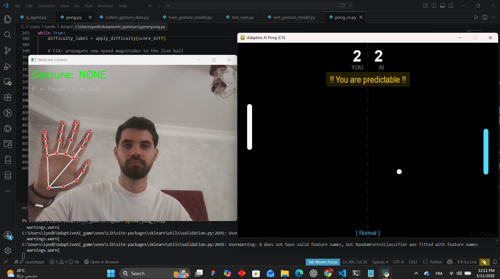
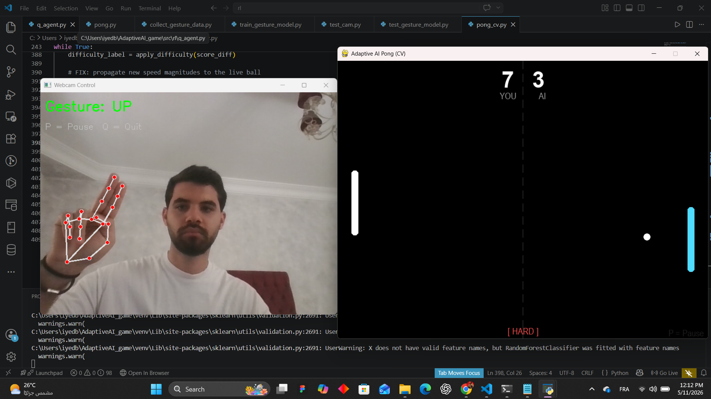

# Adaptive AI Pong 🎮🤖

Un jeu Pong intelligent où :
- **l’IA apprend** en Q‑learning (Q‑table)
- **le joueur contrôle** la raquette avec la webcam (MediaPipe + OpenCV)

---

## ✅ Fonctionnalités

- Q‑Learning pour l’IA (raquette droite)
- Contrôle du joueur par gestes (UP / DOWN / NONE)
- Dataset personnalisé (3000 samples)
- Entraînement ML + choix du meilleur modèle
- Feedback texte + adaptation de difficulté

---

## ✅ Dépendances

```bash
pip install opencv-python mediapipe pygame scikit-learn pandas joblib matplotlib
```

---

## ✅ Structure

```
AdaptiveAI_game/
├── data/
│   ├── processed/         # CSV dataset
│   └── models/            # modèles ML
├── src/
│   ├── cv/                # collecte + test gestes
│   ├── ml/                # entraînement ML
│   ├── rl/                # Q-learning
│   └── game/              # jeu + intégration CV
```

---

## ✅ Étapes

### 1) Collecte dataset
```bash
python src/cv/collect_gesture_data.py
```

### 2) Entraînement ML
```bash
python src/ml/train_gesture_model.py
```

### 3) Test webcam + modèle
```bash
python src/cv/test_gesture_model.py
```

### 4) Lancer le jeu final
```bash
python src/game/pong_cv.py
```

---

## ✅ Contrôles

- **UP** : main en haut
- **DOWN** : main en bas
- **NONE** : main neutre
- **Q** : quitter

---

## Démo



---

## ✅ Auteur
Projet réalisé par **iyed147**.
